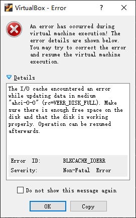
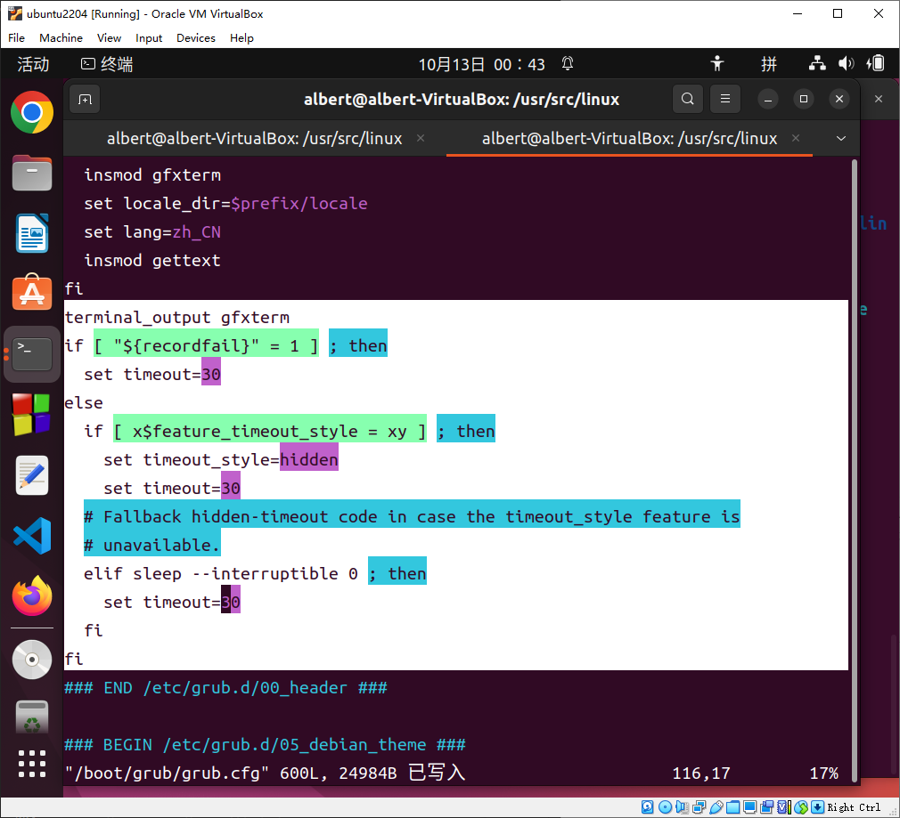
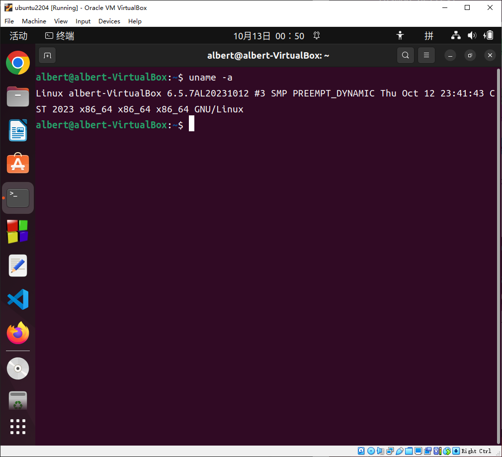

# Download and compile the latest linux kernel

## Target
1. Download the latest linux kernel

2. config the latest linux kernel

3. compile the latest linux kernel

4. boot ubuntu with the latest linux kernel

## preparations

### install related software package

```
sudo apt-get update
sudo apt-get upgrade
```

```
sudo apt-get install build-essential
```

```
sudo apt-get install wget
```

```
sudo apt-get install pkg-config
sudo apt-get install libgtk2.0-dev
sudo apt-get install libcanberra-gtk-module
sudo apt-get install glade
sudo apt-get install libglade2-dev
```

```
sudo apt-get install flex bison
sudo apt-get install libssl-dev
sudo apt-get install libelf-dev
sudo apt-get install libncurses-dev
```

### view the current linux kernel version
```
$ uname -r
6.2.0-34-generic
$
```

### check the unused disk and ensure sufficient disk free space of "/"
```
$ df -BG
文件系统       1G的块  已用  可用 已用% 挂载点
tmpfs              1G    1G    1G    1% /run
/dev/sda3         59G   29G   28G   52% /
tmpfs              4G    0G    4G    0% /dev/shm
tmpfs              1G    1G    1G    1% /run/lock
tmpfs              4G    0G    4G    0% /run/qemu
/dev/sda2          1G    1G    1G    2% /boot/efi
tmpfs              1G    1G    1G    1% /run/user/1000
$ 
```
很有可能没有磁盘空间啊：建议预留30GB空闲空间


## How to do

Download and compile the latest linux kernel
### the latest linux kernel
Linux Stable Kernel: 5.6.7  (2023.10.11)

### 1. Download the latest linux kernel from www.kernel.org

* [linux kernel 6.5.7](https://cdn.kernel.org/pub/linux/kernel/v6.x/linux-6.5.7.tar.xz)

```
cd ~
pwd
```

```
wget -c https://cdn.kernel.org/pub/linux/kernel/v6.x/linux-6.5.7.tar.xz
```

```
tar xvJf linux-6.5.7.tar.xz
```

```
sudo ln -s `pwd`/linux-6.5.7 /usr/src/linux
```


### 2. config the latest linux kernel

```
cd /usr/src/linux
cp /boot/config-`uname -r`   .config
```

```
make oldconfig
此步骤需要一定的时间进行选择，一般选择N或n即可。

or: some wrong for the next command in linux-6.5.7
yes " " | make oldconfig
```
```
make gconfig
```

### 3. customized config

#### 3.1. add local version

add your ID as local version
务必在新内核中嵌入你的学号！！！


#### 3.2. some errors 

##### 3.2.1 arch/x86/Makefile:148: CONFIG_X86_X32 enabled but no binutils support

solution:disable the Binary Emulations


##### 3.2.2 No rule to make target ‘debian/canonical-certs.pem‘, needed by ‘certs/x509_certificate_list 

solution: set CONFIG_SYSTEM_TRUSTED_KEYS=""

in crytoXXX item of config

```
# Certificates for signature checking
#
CONFIG_MODULE_SIG_KEY="certs/signing_key.pem"
CONFIG_MODULE_SIG_KEY_TYPE_RSA=y
# CONFIG_MODULE_SIG_KEY_TYPE_ECDSA is not set
CONFIG_SYSTEM_TRUSTED_KEYRING=y

#CONFIG_SYSTEM_TRUSTED_KEYS="debian/canonical-certs.pem"
CONFIG_SYSTEM_TRUSTED_KEYS=""

CONFIG_SYSTEM_EXTRA_CERTIFICATE=y
CONFIG_SYSTEM_EXTRA_CERTIFICATE_SIZE=4096
CONFIG_SECONDARY_TRUSTED_KEYRING=y
CONFIG_SYSTEM_BLACKLIST_KEYRING=y
CONFIG_SYSTEM_BLACKLIST_HASH_LIST=""
CONFIG_SYSTEM_REVOCATION_LIST=y

#CONFIG_SYSTEM_REVOCATION_KEYS="debian/canonical-revoked-certs.pem"
CONFIG_SYSTEM_REVOCATION_KEYS=""
# CONFIG_SYSTEM_BLACKLIST_AUTH_UPDATE is not set
# end of Certificates for signature checking
```


### (optional)4. clean the previous compilings

If you want to recompile , please execute the following command to clean the previous work:
 
```
make clean
```

### 5. compile the latest linux kernel (long wait)

compile the latest linux kernel
```
make -j4
```
此步骤需要执行很长时间，也有可能会出错。为了确认确实正常编译成功了，可再执行一遍make，这次会很快完成。
```
$ make
  CALL    scripts/checksyscalls.sh
  DESCEND objtool
  INSTALL libsubcmd_headers
  CHK     kernel/kheaders_data.tar.xz
Kernel: arch/x86/boot/bzImage is ready  (#3)
$
```

install the latest linux kernel
```
sudo make modules_install
sudo make install
```


Successfully compiled:
```
/usr/src/linux$  sudo make install
  INSTALL /boot
run-parts: executing /etc/kernel/postinst.d/initramfs-tools 6.5.7AL20231012 /boot/vmlinuz-6.5.7AL20231012
update-initramfs: Generating /boot/initrd.img-6.5.7AL20231012
run-parts: executing /etc/kernel/postinst.d/unattended-upgrades 6.5.7AL20231012 /boot/vmlinuz-6.5.7AL20231012
run-parts: executing /etc/kernel/postinst.d/update-notifier 6.5.7AL20231012 /boot/vmlinuz-6.5.7AL20231012
run-parts: executing /etc/kernel/postinst.d/vboxadd 6.5.7AL20231012 /boot/vmlinuz-6.5.7AL20231012
run-parts: executing /etc/kernel/postinst.d/xx-update-initrd-links 6.5.7AL20231012 /boot/vmlinuz-6.5.7AL20231012
I: /boot/initrd.img is now a symlink to initrd.img-6.5.7AL20231012
run-parts: executing /etc/kernel/postinst.d/zz-shim 6.5.7AL20231012 /boot/vmlinuz-6.5.7AL20231012
run-parts: executing /etc/kernel/postinst.d/zz-update-grub 6.5.7AL20231012 /boot/vmlinuz-6.5.7AL20231012
Sourcing file `/etc/default/grub'
Sourcing file `/etc/default/grub.d/init-select.cfg'
Generating grub configuration file ...
Found linux image: /boot/vmlinuz-6.5.7AL20231012
Found initrd image: /boot/initrd.img-6.5.7AL20231012
Found linux image: /boot/vmlinuz-6.2.0-34-generic
Found initrd image: /boot/initrd.img-6.2.0-34-generic
Found memtest86+ image: /boot/memtest86+.elf
Found memtest86+ image: /boot/memtest86+.bin
Warning: os-prober will not be executed to detect other bootable partitions.
Systems on them will not be added to the GRUB boot configuration.
Check GRUB_DISABLE_OS_PROBER documentation entry.
done
/usr/src/linux$ 
```
### 6.(optional) modify the grub.cfg
```
sudo vi /boot/grub/grub.cfg
```
set timeout=30

### 7. boot ubuntu with the latest linux kernel

```
sudo reboot
```

```
uname -a
```



End.
