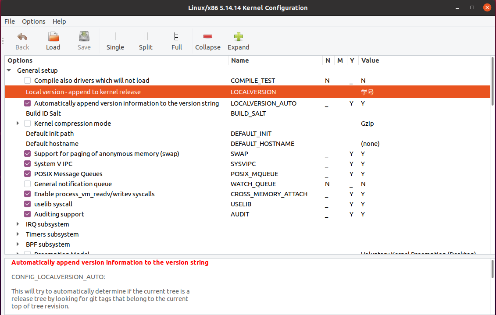
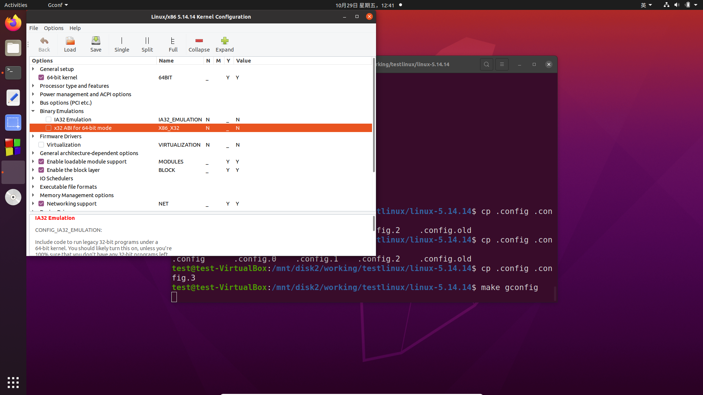
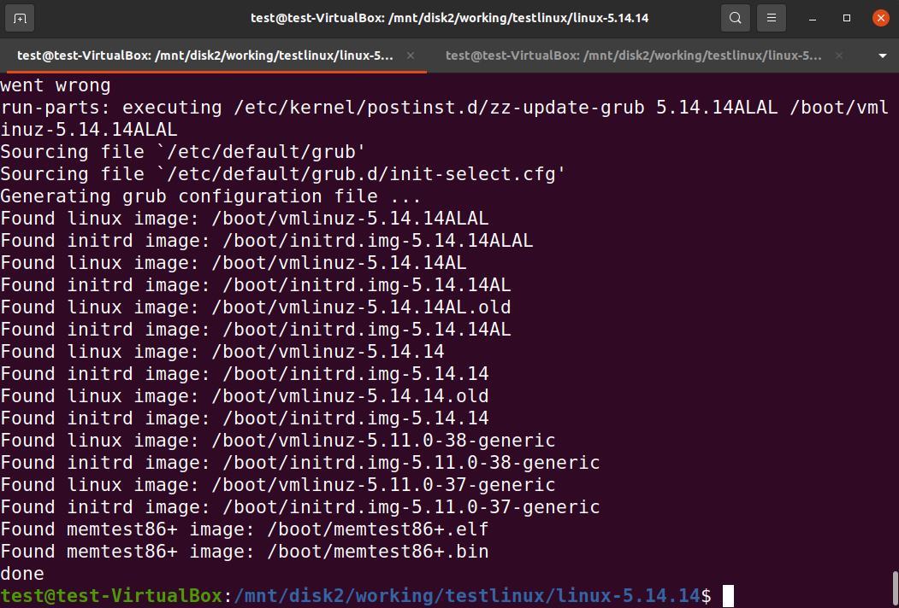
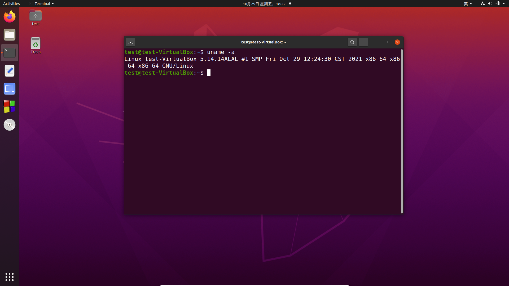

# Download and compile the latest linux kernel

## Target
1. Download the latest linux kernel

2. config the latest linux kernel

3. compile the latest linux kernel

4. boot ubuntu with the latest linux kernel

## preparations

### install related software package

```
sudo apt-get update
sudo apt-get upgrade
```

```
sudo apt-get install build-essential
```

```
sudo apt-get install wget
```

```
sudo apt-get install pkg-config
sudo apt-get install libgtk2.0-dev
sudo apt-get install libcanberra-gtk-module
sudo apt-get install glade libglade2-dev
```

```
sudo apt-get install flex bison
sudo apt-get install libssl-dev
sudo apt-get install libelf-dev
sudo apt-get install libncurses-dev
```

### view the current linux kernel version
```
uname -a
```

## How to do

Download and compile the latest linux kernel
### the latest linux kernel
Linux Stable Kernel: 5.14.14  (2021.10.26)

### 1. Download the latest linux kernel from www.kernel.org

* [linux kernel 5.14.14](https://cdn.kernel.org/pub/linux/kernel/v5.x/linux-5.14.14.tar.xz)

```
cd ~
pwd
```

```
wget -c https://cdn.kernel.org/pub/linux/kernel/v5.x/linux-5.14.14.tar.xz
```

```
tar xvJf linux-5.14.14.tar.xz
```

```
sudo ln -s `pwd`/linux-5.14.14 /usr/src/linux
```


### 2. config the latest linux kernel

```
cd /usr/src/linux
cp /boot/config-`uname -r`   .config
```

```
yes " " | make oldconfig
make gconfig
```

### 3. customized config

#### 3.1. add local version

add your ID as local version



#### 3.2. some errors 

##### 3.2.1 arch/x86/Makefile:148: CONFIG_X86_X32 enabled but no binutils support

solution:disable the Binary Emulations



##### 3.2.2 No rule to make target ‘debian/canonical-certs.pem‘, needed by ‘certs/x509_certificate_list 

solution: set CONFIG_SYSTEM_TRUSTED_KEYS=""

in crytoXXX item of config


### (optional)4. clean the previous compilings

If you want to recompile , please execute the following command to clean the previous work:
 
```
make clean
```

### 5. compile the latest linux kernel (long wait)

compile the latest linux kernel
```
make -j4
```
install the latest linux kernel
```
sudo make modules_install
sudo make install
```

Successfully compiled:



### 6. boot ubuntu with the latest linux kernel

```
sudo reboot
```

```
uname -a
```



End.
