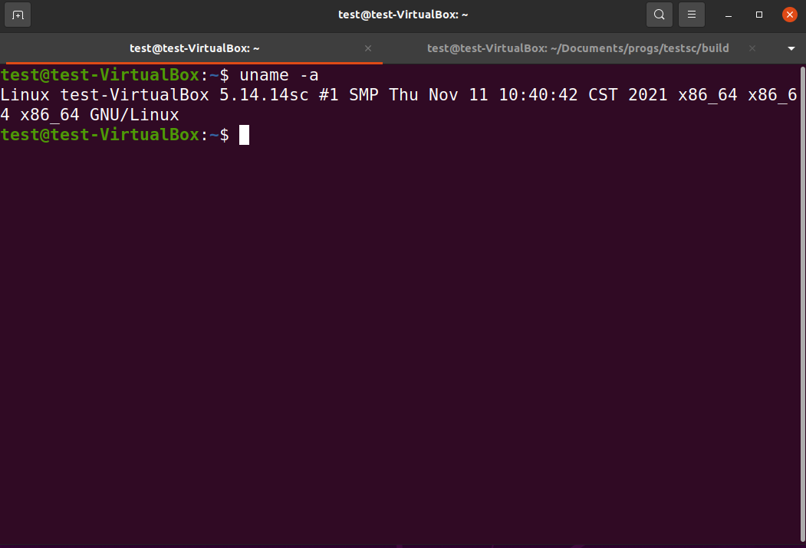

# Add a New System Call

## Target
1. Add a new system call into the linux kernel

2. Test the new system call in user model


## Tools

### Install GCC Software Colletion
```
sudo apt-get install build-essential
```
### How to use GCC
* [gcc and make](https://www3.ntu.edu.sg/home/ehchua/programming/cpp/gcc_make.html)


## How to do
see the pdf document: newsyscall2020.pdf

### Step0 

new customized kernel config: [config1](config_ubuntu2004_20211129), [config2](config_5_14_14_ubuntuok)

### Step1 (Linux kernel 5.19)

include/linux/syscalls.h

在文件(No. 1279)
#endif /* CONFIG_ARCH_HAS_SYSCALL_WRAPPER */之前，添加一行:

asmlinkage long sys_schello(void);

### Step2 (Linux kernel 5.19)

kernel/sys.c
在文件SYSCALL_DEFINE0(gettid)函数之后（No. 949），添加如下行:

SYSCALL_DEFINE0(schello)
{
printk("Hello new system call schello!Your ID\n");
return 0;
}

### Step3  (Linux kernel 5.19)

针对64位OS
arch/x86/entry/syscalls/syscall_64.tbl
在文件334 common  memfd_secret        sys_memfd_secret 行之后，添加如下行:

335 common schello sys_schello

### Step4

make clean
make -j5
sudo make modules_install
sudo make install

### Step 5

重新启动:

reboot

确认新内核是否成功运行：

```
uname -a
```




### Step 6

编写用户态测试程序testschello.c

```
#include <unistd.h>
#include <sys/syscall.h>
#include <sys/types.h>
#include <stdio.h>
#define __NR_schello 336
int main(int argc, char *argv[])
{
 syscall(_NR_schello);
 print("ok! run dmesg | grep hello in terminal!\n");
 return 0;
}
```


### Step 7

编译用户态测试程序testschello.c，并执行

```
gcc -o testsc testschello.c

$ sudo dmesg -C

./testsc

$dmesg | grep schello

[ 1648.215250] Hello new system call schello!

```


### End.
