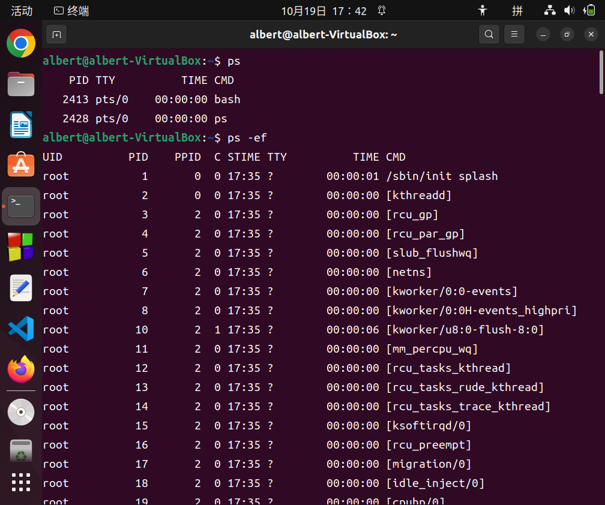
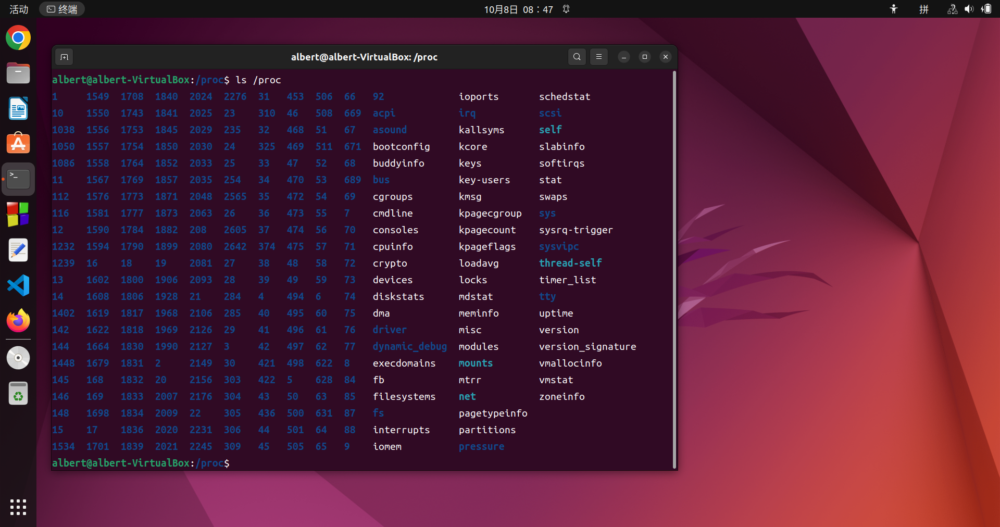
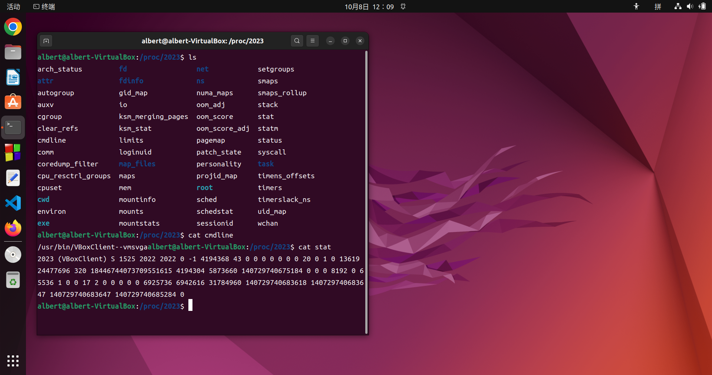

# Write a c/c++ program to list all processes in user-mode

## Target
1. Write a c/c++ program
2. To list all processes in user-mode
```
ps -ef
```
类似如下结果: UID, PID, PPID, C, STIME, TTY, TIME, CMD

1. GCC
2. IDE 集成开发环境
3. in user-mode
   1. /proc dir contains all informations of all processes

## Tools

### Install GCC Software Collection
```
sudo apt-get install build-essential
```
### How to use GCC
* [gcc and make](https://www3.ntu.edu.sg/home/ehchua/programming/cpp/gcc_make.html)

### IDE
1. (推荐)Code::Blocks
```
sudo apt-get install codeblocks
```
2. vim + gcc

### /porc


```
cd /proc/2023
```


status file:
```
$ more status
Name:	VBoxClient
Umask:	0027
State:	S (sleeping)
Tgid:	2023
Ngid:	0
Pid:	2023
PPid:	1525
TracerPid:	0
Uid:	1000	1000	1000	1000
Gid:	1000	1000	1000	1000
FDSize:	64
Groups:	4 24 27 30 46 122 134 135 999 1000 
NStgid:	2023
NSpid:	2023
NSpgid:	2022
NSsid:	2022
VmPeak:	   23904 kB
VmSize:	   23904 kB
VmLck:	       0 kB
VmPin:	       0 kB
VmHWM:	    1280 kB
VmRSS:	    1280 kB
RssAnon:	     256 kB
...
```
cmdline file:
```
$cat cmdline
usr/sbin/cups-browsed
$
```
stat file:
```
$cat stat
778 (cups-browsed) S 1 778 778 0 -1 4194560 781 0 22 0 2 0 0 0 20 0 3 0 4249 176762880 2816 18446744073709551615 1 1 0 0 0 0 0 4096 18946 0 0 0 17 1 0 0 0 0 0 0 0 0 0 0 0 0 0
$ 
```
### structure of directory
```
struct dirent
{
    ino_t d_ino; //d_ino 此目录进入点的inode
    ff_t d_off; //d_off 目录文件开头至此目录进入点的位移
    signed short int d_reclen; //d_reclen _name 的长度, 不包含NULL 字符
    unsigned char d_type; //d_type d_name 所指的文件类型 d_name 文件名
    har d_name[256];
};

the value returned in d_type:
              DT_BLK      This is a block device.
              DT_CHR      This is a character device.
              DT_DIR      This is a directory.
              DT_FIFO     This is a named pipe (FIFO).
              DT_LNK      This is a symbolic link.
              DT_REG      This is a regular file.
              DT_SOCK     This is a UNIX domain socket.
              DT_UNKNOWN  The file type could not be determined.

opendir()
readdir()
closedir()

```

### Create a symbol link file
```
#include <fcntl.h>           /* Definition of AT_* constants */
#include <unistd.h>
int link(const char *oldpath, const char *newpath);
```

### ps
```
$ ps -ef
UID          PID    PPID  C STIME TTY          TIME CMD
root           1       0  0 12:03 ?        00:00:01 /sbin/init splash
root           2       0  0 12:03 ?        00:00:00 [kthreadd]
root           3       2  0 12:03 ?        00:00:00 [rcu_gp]
root           4       2  0 12:03 ?        00:00:00 [rcu_par_gp]
root           5       2  0 12:03 ?        00:00:00 [slub_flushwq]
root           6       2  0 12:03 ?        00:00:00 [netns]
root           7       2  0 12:03 ?        00:00:00 [kworker/0:0-events]
root           8       2  0 12:03 ?        00:00:00 [kworker/0:0H-events_highpri
root           9       2  0 12:03 ?        00:00:00 [kworker/u8:0-events_unbound
root          10       2  0 12:03 ?        00:00:00 [mm_percpu_wq]
root          11       2  0 12:03 ?        00:00:00 [rcu_tasks_kthread]
root          12       2  0 12:03 ?        00:00:00 [rcu_tasks_rude_kthread]
...

```

## How to do

**write a c program** to list all processes in user-mode, the result is same to ps cmd

...

### 1. Example of traverse one directory

```
#include <dirent.h>
#include <unistd.h>
#include <stdlib.h>

int main()
{
    DIR * dir;
    struct dirent * ptr;
	/*open dir*/
    dir = opendir("/home");
	/*read dir entry*/
    while((ptr = readdir(dir)) != NULL)
    {
        printf("d_name : %s", ptr->d_name);
		if (ptr->d_type==DT_DIR){
        	printf("\tDir");
		}
        	printf("\n");
    }
	/*close dir*/
    closedir(dir);
	exit(0);
}
```

Compiling:
```
gcc     listdir.c   -o listdir
./listdir
```

