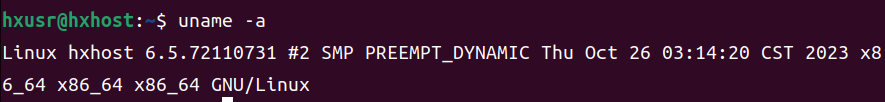

# Add a New System Call  to say hello

## Target
1. Add a new system call into the linux kernel

2. Test the new system call in user model


## Tools

### Install GCC Software Colletion
```
sudo apt-get install build-essential
```
### How to use GCC
* [gcc and make](https://www3.ntu.edu.sg/home/ehchua/programming/cpp/gcc_make.html)

## How to do

### Step0

new customized kernel config:6.5.x

### Step1 (Linux kernel 6.2+)

在文件 include/linux/syscalls.h (第1176行)
```
#endif /* CONFIG_ARCH_HAS_SYSCALL_WRAPPER */之前，添加一行:

asmlinkage long sys_schello(void);
```

### Step2 (Linux kernel 6.2+)

kernel/sys.c
在文件SYSCALL_DEFINE0(gettid)函数之后（第958行 ），添加如下行:

```
SYSCALL_DEFINE0(schello)
{
printk("Hello new system call schello!Your ID\n');
print('Hello new system call schello! hello 学号\n');
return 0;
}
```

### Step3  (Linux kernel 6.2+)


### Step4

```
make clean
make -j5
sudo make modules_install
sudo make install
```

### Step 5

重新启动:

reboot

确认新内核是否成功运行：

```
uname -a
// 注：显示和编译版本一致才为正确
```




### Step 6

编写用户态测试程序testschello.c

```
#include <unistd.h>
#include <sys/syscall.h>
#include <sys/types.h>
#include <stdio.h>
#define __NR_schello 336
int main(int argc, char *argv[])
{
 syscall(_NR_schell0);
 printf("ok! run the cmd in terminal: sudo dmesg | grep schello\n");
 return 0;
}
```

### Step 7

编译用户态测试程序testschello.c，并执行

```
# 编译
gcc -o testsc testschello.c
# 运行
./testsc
sudo dmesg | grep schello
```


### Task (lab05)

* 实现上述实例，并输出linux kernel版本号和你的“学号”
* 撰写实验报告

### End.
