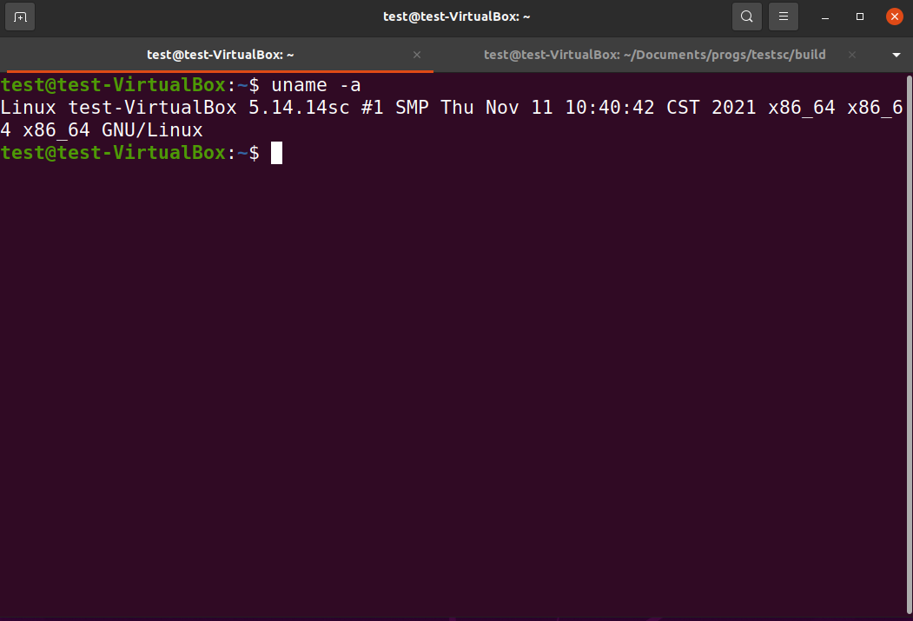
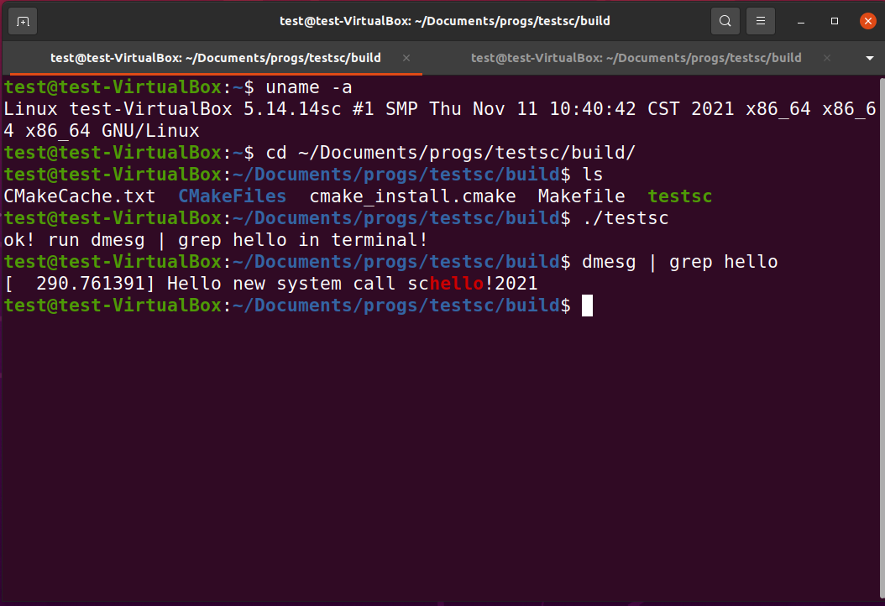

# Add a New System Call  to list all processes

## Target
1. Add a new system call into the linux kernel

2. Test the new system call in user model


## Tools

### Install GCC Software Colletion
```
sudo apt-get install build-essential
```
### How to use GCC
* [gcc and make](https://www3.ntu.edu.sg/home/ehchua/programming/cpp/gcc_make.html)


## How to do
see the pdf document: newsyscall_step2.pdf

### Step0 

new customized kernel config: [config1](config_ubuntu2004_20211129), [config2](config_5_14_14_ubuntuok)

### Step1 (Linux kernel 5.19)

include/linux/syscalls.h

在文件(No. 1279)
#endif /* CONFIG_ARCH_HAS_SYSCALL_WRAPPER */之前，添加一行:

asmlinkage long sys_schello(void);

### Step2 (Linux kernel 5.19)

kernel/sys.c
在文件SYSCALL_DEFINE0(gettid)函数之后（No. 949），添加如下行:

SYSCALL_DEFINE0(schello)
{
printk("Hello new system call schello!Your ID\n");
return 0;
}

### Step3  (Linux kernel 5.19)

针对64位OS
arch/x86/entry/syscalls/syscall_64.tbl
在文件334 common  memfd_secret        sys_memfd_secret 行之后，添加如下行:

335 common schello sys_schello

### Step4

make clean
make -j5
sudo make modules_install
sudo make install

### Step 5

重新启动:

reboot

确认新内核是否成功运行：

```
uname -a
```




### Step 6

编写用户态测试程序testschello.c

```
#include <unistd.h>
#include <sys/syscall.h>
#include <sys/types.h>
#include <stdio.h>
#define __NR_schello 336
int main(int argc, char *argv[])
{
 syscall(_NR_schello);
 print("ok! run dmesg | grep hello in terminal!\n");
 return 0;
}
```


### Step 7

编译用户态测试程序testschello.c，并执行

```
gcc -o testsc testschello.c

$ sudo dmesg -C

./testsc

$dmesg | grep schello

[ 1648.215250] Hello new system call schello!

```



### process in Linux kernel

<linux/sched.h>

```
struct task_struct {
#ifdef CONFIG_THREAD_INFO_IN_TASK
	/*
	 * For reasons of header soup (see current_thread_info()), this
	 * must be the first element of task_struct.
	 */
	struct thread_info		thread_info;
#endif
	unsigned int			__state;

#ifdef CONFIG_PREEMPT_RT
	/* saved state for "spinlock sleepers" */
	unsigned int			saved_state;
#endif

	/*
	 * This begins the randomizable portion of task_struct. Only
	 * scheduling-critical items should be added above here.
	 */
	randomized_struct_fields_start

	void				*stack;
	refcount_t			usage;
	/* Per task flags (PF_*), defined further below: */
	unsigned int			flags;
	unsigned int			ptrace;

#ifdef CONFIG_SMP
	int				on_cpu;
	struct __call_single_node	wake_entry;
	unsigned int			wakee_flips;
	unsigned long			wakee_flip_decay_ts;
	struct task_struct		*last_wakee;

	/*
	 * recent_used_cpu is initially set as the last CPU used by a task
	 * that wakes affine another task. Waker/wakee relationships can
	 * push tasks around a CPU where each wakeup moves to the next one.
	 * Tracking a recently used CPU allows a quick search for a recently
	 * used CPU that may be idle.
	 */
	int				recent_used_cpu;
	int				wake_cpu;
#endif
	int				on_rq;

	int				prio;
	int				static_prio;
	int				normal_prio;
	unsigned int			rt_priority;

	struct sched_entity		se;
	struct sched_rt_entity		rt;
	struct sched_dl_entity		dl;
	const struct sched_class	*sched_class;

#ifdef CONFIG_SCHED_CORE
	struct rb_node			core_node;
	unsigned long			core_cookie;
	unsigned int			core_occupation;
#endif

#ifdef CONFIG_CGROUP_SCHED
	struct task_group		*sched_task_group;
#endif

#ifdef CONFIG_UCLAMP_TASK
	/*
	 * Clamp values requested for a scheduling entity.
	 * Must be updated with task_rq_lock() held.
	 */
	struct uclamp_se		uclamp_req[UCLAMP_CNT];
	/*
	 * Effective clamp values used for a scheduling entity.
	 * Must be updated with task_rq_lock() held.
	 */
	struct uclamp_se		uclamp[UCLAMP_CNT];
#endif

	struct sched_statistics         stats;

#ifdef CONFIG_PREEMPT_NOTIFIERS
	/* List of struct preempt_notifier: */
	struct hlist_head		preempt_notifiers;
#endif

#ifdef CONFIG_BLK_DEV_IO_TRACE
	unsigned int			btrace_seq;
#endif

	unsigned int			policy;
	int				nr_cpus_allowed;
	const cpumask_t			*cpus_ptr;
	cpumask_t			*user_cpus_ptr;
	cpumask_t			cpus_mask;
	void				*migration_pending;
#ifdef CONFIG_SMP
	unsigned short			migration_disabled;
#endif
	unsigned short			migration_flags;

#ifdef CONFIG_PREEMPT_RCU
	int				rcu_read_lock_nesting;
	union rcu_special		rcu_read_unlock_special;
	struct list_head		rcu_node_entry;
	struct rcu_node			*rcu_blocked_node;
#endif /* #ifdef CONFIG_PREEMPT_RCU */

#ifdef CONFIG_TASKS_RCU
	unsigned long			rcu_tasks_nvcsw;
	u8				rcu_tasks_holdout;
	u8				rcu_tasks_idx;
	int				rcu_tasks_idle_cpu;
	struct list_head		rcu_tasks_holdout_list;
#endif /* #ifdef CONFIG_TASKS_RCU */

#ifdef CONFIG_TASKS_TRACE_RCU
	int				trc_reader_nesting;
	int				trc_ipi_to_cpu;
	union rcu_special		trc_reader_special;
	bool				trc_reader_checked;
	struct list_head		trc_holdout_list;
#endif /* #ifdef CONFIG_TASKS_TRACE_RCU */

	struct sched_info		sched_info;

	struct list_head		tasks;
#ifdef CONFIG_SMP
	struct plist_node		pushable_tasks;
	struct rb_node			pushable_dl_tasks;
#endif

	struct mm_struct		*mm;
	struct mm_struct		*active_mm;

	/* Per-thread vma caching: */
	struct vmacache			vmacache;

#ifdef SPLIT_RSS_COUNTING
	struct task_rss_stat		rss_stat;
#endif
	int				exit_state;
	int				exit_code;
	int				exit_signal;
	/* The signal sent when the parent dies: */
	int				pdeath_signal;
	/* JOBCTL_*, siglock protected: */
	unsigned long			jobctl;

	/* Used for emulating ABI behavior of previous Linux versions: */
	unsigned int			personality;

	/* Scheduler bits, serialized by scheduler locks: */
	unsigned			sched_reset_on_fork:1;
	unsigned			sched_contributes_to_load:1;
	unsigned			sched_migrated:1;
#ifdef CONFIG_PSI
	unsigned			sched_psi_wake_requeue:1;
#endif

	/* Force alignment to the next boundary: */
	unsigned			:0;

	/* Unserialized, strictly 'current' */

	/*
	 * This field must not be in the scheduler word above due to wakelist
	 * queueing no longer being serialized by p->on_cpu. However:
	 *
	 * p->XXX = X;			ttwu()
	 * schedule()			  if (p->on_rq && ..) // false
	 *   smp_mb__after_spinlock();	  if (smp_load_acquire(&p->on_cpu) && //true
	 *   deactivate_task()		      ttwu_queue_wakelist())
	 *     p->on_rq = 0;			p->sched_remote_wakeup = Y;
	 *
	 * guarantees all stores of 'current' are visible before
	 * ->sched_remote_wakeup gets used, so it can be in this word.
	 */
	unsigned			sched_remote_wakeup:1;

	/* Bit to tell LSMs we're in execve(): */
	unsigned			in_execve:1;
	unsigned			in_iowait:1;
#ifndef TIF_RESTORE_SIGMASK
	unsigned			restore_sigmask:1;
#endif
#ifdef CONFIG_MEMCG
	unsigned			in_user_fault:1;
#endif
#ifdef CONFIG_COMPAT_BRK
	unsigned			brk_randomized:1;
#endif
#ifdef CONFIG_CGROUPS
	/* disallow userland-initiated cgroup migration */
	unsigned			no_cgroup_migration:1;
	/* task is frozen/stopped (used by the cgroup freezer) */
	unsigned			frozen:1;
#endif
#ifdef CONFIG_BLK_CGROUP
	unsigned			use_memdelay:1;
#endif
#ifdef CONFIG_PSI
	/* Stalled due to lack of memory */
	unsigned			in_memstall:1;
#endif
#ifdef CONFIG_PAGE_OWNER
	/* Used by page_owner=on to detect recursion in page tracking. */
	unsigned			in_page_owner:1;
#endif
#ifdef CONFIG_EVENTFD
	/* Recursion prevention for eventfd_signal() */
	unsigned			in_eventfd_signal:1;
#endif
#ifdef CONFIG_IOMMU_SVA
	unsigned			pasid_activated:1;
#endif
#ifdef	CONFIG_CPU_SUP_INTEL
	unsigned			reported_split_lock:1;
#endif

	unsigned long			atomic_flags; /* Flags requiring atomic access. */

	struct restart_block		restart_block;

	pid_t				pid;
	pid_t				tgid;

#ifdef CONFIG_STACKPROTECTOR
	/* Canary value for the -fstack-protector GCC feature: */
	unsigned long			stack_canary;
#endif
	/*
	 * Pointers to the (original) parent process, youngest child, younger sibling,
	 * older sibling, respectively.  (p->father can be replaced with
	 * p->real_parent->pid)
	 */

	/* Real parent process: */
	struct task_struct __rcu	*real_parent;

	/* Recipient of SIGCHLD, wait4() reports: */
	struct task_struct __rcu	*parent;

	/*
	 * Children/sibling form the list of natural children:
	 */
	struct list_head		children;
	struct list_head		sibling;
	struct task_struct		*group_leader;

	/*
	 * 'ptraced' is the list of tasks this task is using ptrace() on.
	 *
	 * This includes both natural children and PTRACE_ATTACH targets.
	 * 'ptrace_entry' is this task's link on the p->parent->ptraced list.
	 */
	struct list_head		ptraced;
	struct list_head		ptrace_entry;

	/* PID/PID hash table linkage. */
	struct pid			*thread_pid;
	struct hlist_node		pid_links[PIDTYPE_MAX];
	struct list_head		thread_group;
	struct list_head		thread_node;

	struct completion		*vfork_done;

	/* CLONE_CHILD_SETTID: */
	int __user			*set_child_tid;

	/* CLONE_CHILD_CLEARTID: */
	int __user			*clear_child_tid;

	/* PF_KTHREAD | PF_IO_WORKER */
	void				*worker_private;

	u64				utime;
	u64				stime;
#ifdef CONFIG_ARCH_HAS_SCALED_CPUTIME
	u64				utimescaled;
	u64				stimescaled;
#endif
	u64				gtime;
	struct prev_cputime		prev_cputime;
#ifdef CONFIG_VIRT_CPU_ACCOUNTING_GEN
	struct vtime			vtime;
#endif

#ifdef CONFIG_NO_HZ_FULL
	atomic_t			tick_dep_mask;
#endif
	/* Context switch counts: */
	unsigned long			nvcsw;
	unsigned long			nivcsw;

	/* Monotonic time in nsecs: */
	u64				start_time;

	/* Boot based time in nsecs: */
	u64				start_boottime;

	/* MM fault and swap info: this can arguably be seen as either mm-specific or thread-specific: */
	unsigned long			min_flt;
	unsigned long			maj_flt;

	/* Empty if CONFIG_POSIX_CPUTIMERS=n */
	struct posix_cputimers		posix_cputimers;

#ifdef CONFIG_POSIX_CPU_TIMERS_TASK_WORK
	struct posix_cputimers_work	posix_cputimers_work;
#endif

	/* Process credentials: */

	/* Tracer's credentials at attach: */
	const struct cred __rcu		*ptracer_cred;

	/* Objective and real subjective task credentials (COW): */
	const struct cred __rcu		*real_cred;

	/* Effective (overridable) subjective task credentials (COW): */
	const struct cred __rcu		*cred;

#ifdef CONFIG_KEYS
	/* Cached requested key. */
	struct key			*cached_requested_key;
#endif

	/*
	 * executable name, excluding path.
	 *
	 * - normally initialized setup_new_exec()
	 * - access it with [gs]et_task_comm()
	 * - lock it with task_lock()
	 */
	char				comm[TASK_COMM_LEN];

	struct nameidata		*nameidata;

#ifdef CONFIG_SYSVIPC
	struct sysv_sem			sysvsem;
	struct sysv_shm			sysvshm;
#endif
#ifdef CONFIG_DETECT_HUNG_TASK
	unsigned long			last_switch_count;
	unsigned long			last_switch_time;
#endif
	/* Filesystem information: */
	struct fs_struct		*fs;

	/* Open file information: */
	struct files_struct		*files;

#ifdef CONFIG_IO_URING
	struct io_uring_task		*io_uring;
#endif

	/* Namespaces: */
	struct nsproxy			*nsproxy;

	/* Signal handlers: */
	struct signal_struct		*signal;
	struct sighand_struct __rcu		*sighand;
	sigset_t			blocked;
	sigset_t			real_blocked;
	/* Restored if set_restore_sigmask() was used: */
	sigset_t			saved_sigmask;
	struct sigpending		pending;
	unsigned long			sas_ss_sp;
	size_t				sas_ss_size;
	unsigned int			sas_ss_flags;

	struct callback_head		*task_works;

#ifdef CONFIG_AUDIT
#ifdef CONFIG_AUDITSYSCALL
	struct audit_context		*audit_context;
#endif
	kuid_t				loginuid;
	unsigned int			sessionid;
#endif
	struct seccomp			seccomp;
	struct syscall_user_dispatch	syscall_dispatch;

	/* Thread group tracking: */
	u64				parent_exec_id;
	u64				self_exec_id;

	/* Protection against (de-)allocation: mm, files, fs, tty, keyrings, mems_allowed, mempolicy: */
	spinlock_t			alloc_lock;

	/* Protection of the PI data structures: */
	raw_spinlock_t			pi_lock;

	struct wake_q_node		wake_q;

#ifdef CONFIG_RT_MUTEXES
	/* PI waiters blocked on a rt_mutex held by this task: */
	struct rb_root_cached		pi_waiters;
	/* Updated under owner's pi_lock and rq lock */
	struct task_struct		*pi_top_task;
	/* Deadlock detection and priority inheritance handling: */
	struct rt_mutex_waiter		*pi_blocked_on;
#endif

#ifdef CONFIG_DEBUG_MUTEXES
	/* Mutex deadlock detection: */
	struct mutex_waiter		*blocked_on;
#endif

#ifdef CONFIG_DEBUG_ATOMIC_SLEEP
	int				non_block_count;
#endif

#ifdef CONFIG_TRACE_IRQFLAGS
	struct irqtrace_events		irqtrace;
	unsigned int			hardirq_threaded;
	u64				hardirq_chain_key;
	int				softirqs_enabled;
	int				softirq_context;
	int				irq_config;
#endif
#ifdef CONFIG_PREEMPT_RT
	int				softirq_disable_cnt;
#endif

#ifdef CONFIG_LOCKDEP
# define MAX_LOCK_DEPTH			48UL
	u64				curr_chain_key;
	int				lockdep_depth;
	unsigned int			lockdep_recursion;
	struct held_lock		held_locks[MAX_LOCK_DEPTH];
#endif

#if defined(CONFIG_UBSAN) && !defined(CONFIG_UBSAN_TRAP)
	unsigned int			in_ubsan;
#endif

	/* Journalling filesystem info: */
	void				*journal_info;

	/* Stacked block device info: */
	struct bio_list			*bio_list;

	/* Stack plugging: */
	struct blk_plug			*plug;

	/* VM state: */
	struct reclaim_state		*reclaim_state;

	struct backing_dev_info		*backing_dev_info;

	struct io_context		*io_context;

#ifdef CONFIG_COMPACTION
	struct capture_control		*capture_control;
#endif
	/* Ptrace state: */
	unsigned long			ptrace_message;
	kernel_siginfo_t		*last_siginfo;

	struct task_io_accounting	ioac;
#ifdef CONFIG_PSI
	/* Pressure stall state */
	unsigned int			psi_flags;
#endif
#ifdef CONFIG_TASK_XACCT
	/* Accumulated RSS usage: */
	u64				acct_rss_mem1;
	/* Accumulated virtual memory usage: */
	u64				acct_vm_mem1;
	/* stime + utime since last update: */
	u64				acct_timexpd;
#endif
#ifdef CONFIG_CPUSETS
	/* Protected by ->alloc_lock: */
	nodemask_t			mems_allowed;
	/* Sequence number to catch updates: */
	seqcount_spinlock_t		mems_allowed_seq;
	int				cpuset_mem_spread_rotor;
	int				cpuset_slab_spread_rotor;
#endif
#ifdef CONFIG_CGROUPS
	/* Control Group info protected by css_set_lock: */
	struct css_set __rcu		*cgroups;
	/* cg_list protected by css_set_lock and tsk->alloc_lock: */
	struct list_head		cg_list;
#endif
#ifdef CONFIG_X86_CPU_RESCTRL
	u32				closid;
	u32				rmid;
#endif
#ifdef CONFIG_FUTEX
	struct robust_list_head __user	*robust_list;
#ifdef CONFIG_COMPAT
	struct compat_robust_list_head __user *compat_robust_list;
#endif
	struct list_head		pi_state_list;
	struct futex_pi_state		*pi_state_cache;
	struct mutex			futex_exit_mutex;
	unsigned int			futex_state;
#endif
#ifdef CONFIG_PERF_EVENTS
	struct perf_event_context	*perf_event_ctxp[perf_nr_task_contexts];
	struct mutex			perf_event_mutex;
	struct list_head		perf_event_list;
#endif
#ifdef CONFIG_DEBUG_PREEMPT
	unsigned long			preempt_disable_ip;
#endif
#ifdef CONFIG_NUMA
	/* Protected by alloc_lock: */
	struct mempolicy		*mempolicy;
	short				il_prev;
	short				pref_node_fork;
#endif
#ifdef CONFIG_NUMA_BALANCING
	int				numa_scan_seq;
	unsigned int			numa_scan_period;
	unsigned int			numa_scan_period_max;
	int				numa_preferred_nid;
	unsigned long			numa_migrate_retry;
	/* Migration stamp: */
	u64				node_stamp;
	u64				last_task_numa_placement;
	u64				last_sum_exec_runtime;
	struct callback_head		numa_work;

	/*
	 * This pointer is only modified for current in syscall and
	 * pagefault context (and for tasks being destroyed), so it can be read
	 * from any of the following contexts:
	 *  - RCU read-side critical section
	 *  - current->numa_group from everywhere
	 *  - task's runqueue locked, task not running
	 */
	struct numa_group __rcu		*numa_group;

	/*
	 * numa_faults is an array split into four regions:
	 * faults_memory, faults_cpu, faults_memory_buffer, faults_cpu_buffer
	 * in this precise order.
	 *
	 * faults_memory: Exponential decaying average of faults on a per-node
	 * basis. Scheduling placement decisions are made based on these
	 * counts. The values remain static for the duration of a PTE scan.
	 * faults_cpu: Track the nodes the process was running on when a NUMA
	 * hinting fault was incurred.
	 * faults_memory_buffer and faults_cpu_buffer: Record faults per node
	 * during the current scan window. When the scan completes, the counts
	 * in faults_memory and faults_cpu decay and these values are copied.
	 */
	unsigned long			*numa_faults;
	unsigned long			total_numa_faults;

	/*
	 * numa_faults_locality tracks if faults recorded during the last
	 * scan window were remote/local or failed to migrate. The task scan
	 * period is adapted based on the locality of the faults with different
	 * weights depending on whether they were shared or private faults
	 */
	unsigned long			numa_faults_locality[3];

	unsigned long			numa_pages_migrated;
#endif /* CONFIG_NUMA_BALANCING */

#ifdef CONFIG_RSEQ
	struct rseq __user *rseq;
	u32 rseq_sig;
	/*
	 * RmW on rseq_event_mask must be performed atomically
	 * with respect to preemption.
	 */
	unsigned long rseq_event_mask;
#endif

	struct tlbflush_unmap_batch	tlb_ubc;

	union {
		refcount_t		rcu_users;
		struct rcu_head		rcu;
	};

	/* Cache last used pipe for splice(): */
	struct pipe_inode_info		*splice_pipe;

	struct page_frag		task_frag;

#ifdef CONFIG_TASK_DELAY_ACCT
	struct task_delay_info		*delays;
#endif

#ifdef CONFIG_FAULT_INJECTION
	int				make_it_fail;
	unsigned int			fail_nth;
#endif
	/*
	 * When (nr_dirtied >= nr_dirtied_pause), it's time to call
	 * balance_dirty_pages() for a dirty throttling pause:
	 */
	int				nr_dirtied;
	int				nr_dirtied_pause;
	/* Start of a write-and-pause period: */
	unsigned long			dirty_paused_when;

#ifdef CONFIG_LATENCYTOP
	int				latency_record_count;
	struct latency_record		latency_record[LT_SAVECOUNT];
#endif
	/*
	 * Time slack values; these are used to round up poll() and
	 * select() etc timeout values. These are in nanoseconds.
	 */
	u64				timer_slack_ns;
	u64				default_timer_slack_ns;

#if defined(CONFIG_KASAN_GENERIC) || defined(CONFIG_KASAN_SW_TAGS)
	unsigned int			kasan_depth;
#endif

#ifdef CONFIG_KCSAN
	struct kcsan_ctx		kcsan_ctx;
#ifdef CONFIG_TRACE_IRQFLAGS
	struct irqtrace_events		kcsan_save_irqtrace;
#endif
#ifdef CONFIG_KCSAN_WEAK_MEMORY
	int				kcsan_stack_depth;
#endif
#endif

#if IS_ENABLED(CONFIG_KUNIT)
	struct kunit			*kunit_test;
#endif

#ifdef CONFIG_FUNCTION_GRAPH_TRACER
	/* Index of current stored address in ret_stack: */
	int				curr_ret_stack;
	int				curr_ret_depth;

	/* Stack of return addresses for return function tracing: */
	struct ftrace_ret_stack		*ret_stack;

	/* Timestamp for last schedule: */
	unsigned long long		ftrace_timestamp;

	/*
	 * Number of functions that haven't been traced
	 * because of depth overrun:
	 */
	atomic_t			trace_overrun;

	/* Pause tracing: */
	atomic_t			tracing_graph_pause;
#endif

#ifdef CONFIG_TRACING
	/* State flags for use by tracers: */
	unsigned long			trace;

	/* Bitmask and counter of trace recursion: */
	unsigned long			trace_recursion;
#endif /* CONFIG_TRACING */

#ifdef CONFIG_KCOV
	/* See kernel/kcov.c for more details. */

	/* Coverage collection mode enabled for this task (0 if disabled): */
	unsigned int			kcov_mode;

	/* Size of the kcov_area: */
	unsigned int			kcov_size;

	/* Buffer for coverage collection: */
	void				*kcov_area;

	/* KCOV descriptor wired with this task or NULL: */
	struct kcov			*kcov;

	/* KCOV common handle for remote coverage collection: */
	u64				kcov_handle;

	/* KCOV sequence number: */
	int				kcov_sequence;

	/* Collect coverage from softirq context: */
	unsigned int			kcov_softirq;
#endif

#ifdef CONFIG_MEMCG
	struct mem_cgroup		*memcg_in_oom;
	gfp_t				memcg_oom_gfp_mask;
	int				memcg_oom_order;

	/* Number of pages to reclaim on returning to userland: */
	unsigned int			memcg_nr_pages_over_high;

	/* Used by memcontrol for targeted memcg charge: */
	struct mem_cgroup		*active_memcg;
#endif

#ifdef CONFIG_BLK_CGROUP
	struct request_queue		*throttle_queue;
#endif

#ifdef CONFIG_UPROBES
	struct uprobe_task		*utask;
#endif
#if defined(CONFIG_BCACHE) || defined(CONFIG_BCACHE_MODULE)
	unsigned int			sequential_io;
	unsigned int			sequential_io_avg;
#endif
	struct kmap_ctrl		kmap_ctrl;
#ifdef CONFIG_DEBUG_ATOMIC_SLEEP
	unsigned long			task_state_change;
# ifdef CONFIG_PREEMPT_RT
	unsigned long			saved_state_change;
# endif
#endif
	int				pagefault_disabled;
#ifdef CONFIG_MMU
	struct task_struct		*oom_reaper_list;
	struct timer_list		oom_reaper_timer;
#endif
#ifdef CONFIG_VMAP_STACK
	struct vm_struct		*stack_vm_area;
#endif
#ifdef CONFIG_THREAD_INFO_IN_TASK
	/* A live task holds one reference: */
	refcount_t			stack_refcount;
#endif
#ifdef CONFIG_LIVEPATCH
	int patch_state;
#endif
#ifdef CONFIG_SECURITY
	/* Used by LSM modules for access restriction: */
	void				*security;
#endif
#ifdef CONFIG_BPF_SYSCALL
	/* Used by BPF task local storage */
	struct bpf_local_storage __rcu	*bpf_storage;
	/* Used for BPF run context */
	struct bpf_run_ctx		*bpf_ctx;
#endif

#ifdef CONFIG_GCC_PLUGIN_STACKLEAK
	unsigned long			lowest_stack;
	unsigned long			prev_lowest_stack;
#endif

#ifdef CONFIG_X86_MCE
	void __user			*mce_vaddr;
	__u64				mce_kflags;
	u64				mce_addr;
	__u64				mce_ripv : 1,
					mce_whole_page : 1,
					__mce_reserved : 62;
	struct callback_head		mce_kill_me;
	int				mce_count;
#endif

#ifdef CONFIG_KRETPROBES
	struct llist_head               kretprobe_instances;
#endif
#ifdef CONFIG_RETHOOK
	struct llist_head               rethooks;
#endif

#ifdef CONFIG_ARCH_HAS_PARANOID_L1D_FLUSH
	/*
	 * If L1D flush is supported on mm context switch
	 * then we use this callback head to queue kill work
	 * to kill tasks that are not running on SMT disabled
	 * cores
	 */
	struct callback_head		l1d_flush_kill;
#endif

	/*
	 * New fields for task_struct should be added above here, so that
	 * they are included in the randomized portion of task_struct.
	 */
	randomized_struct_fields_end

	/* CPU-specific state of this task: */
	struct thread_struct		thread;

	/*
	 * WARNING: on x86, 'thread_struct' contains a variable-sized
	 * structure.  It *MUST* be at the end of 'task_struct'.
	 *
	 * Do not put anything below here!
	 */
};

```

### Add new system call to list all processes

**需要列出每个进程的名字(comm)、进程ID号(pid)、父进程ID号、进程状态、学号姓名等**


进程结构体:struct task_struct *p;

双向链表：

```
struct list_head {
	struct list_head *next, *prev;
};
```

第一个进程:init_task

当前的集成:current

进程的兄弟进程:struct list_head		tasks;

进程p的下一个进程:next_task(p)

```
	#define next_task(p) \
		list_entry_rcu((p)->tasks.next, struct task_struct, tasks)
```

遍历所有进程:
```
	#define for_each_process(p) \
		for (p = &init_task ; (p = next_task(p)) != &init_task ; )
```


进程的状态:static inline char task_state_to_char(struct task_struct *tsk)


### 实现框架
kernel/sys.c
在文件SYSCALL_DEFINE0(gettid)函数之后，添加如下行

```
SYSCALL_DEFINE0(schello)
{
struct task_struct *p;
    printf("Hello new system call schello!\n");
    printk("%-20s %-6s %-6s\n","Name","Pid","Stat");
    ...

    return 0;

}
```

### End.
